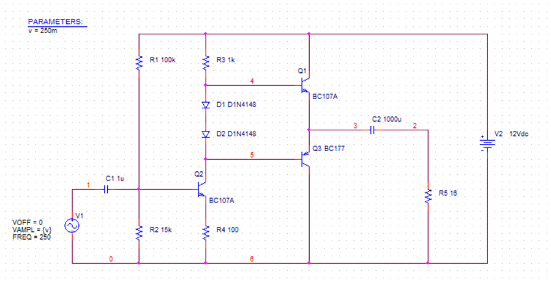
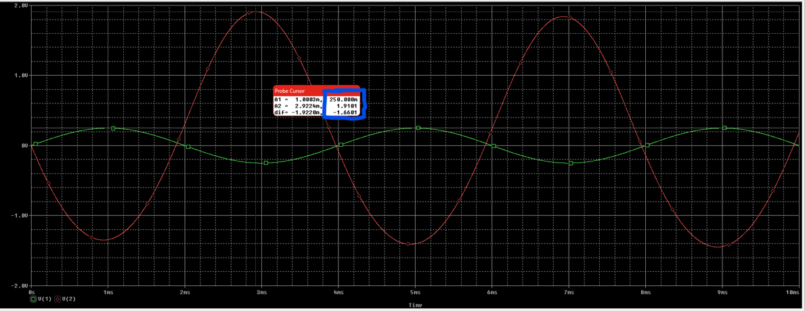
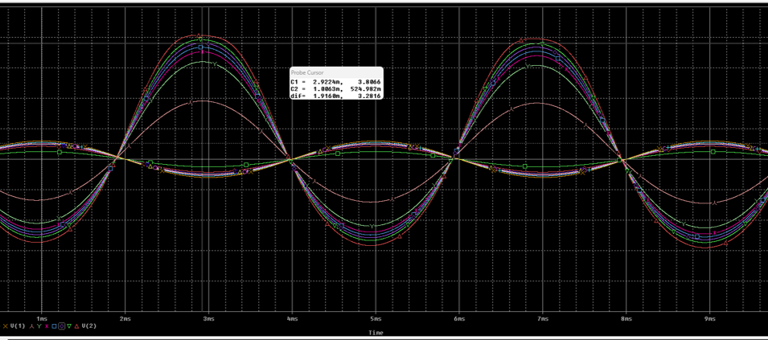
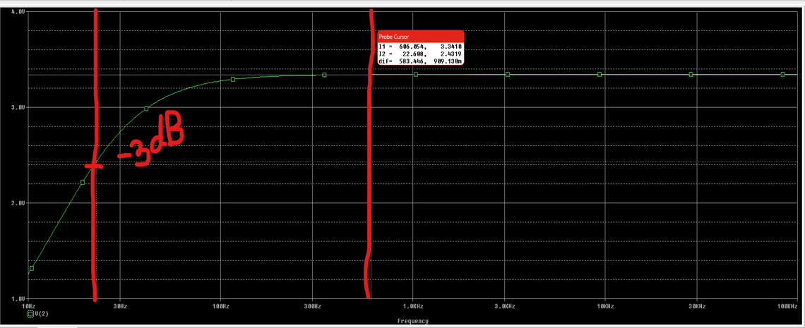
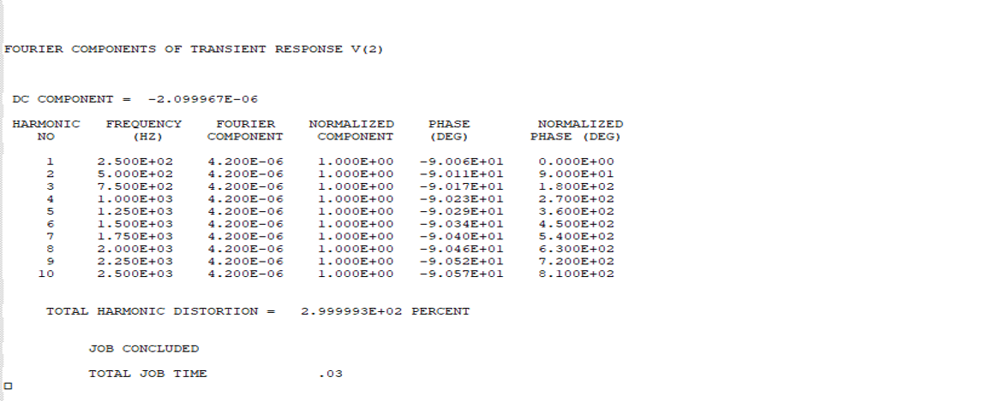

# Class_AB_Amplifier

# Class AB Amplifier Stage Project

## 🔧 Project Description

This project demonstrates the design and simulation of a **Class AB amplifier stage** using discrete components. The amplifier was built and tested in a simulation environment for small-signal performance, frequency response, and harmonic distortion.

---

## 🧩 Schematic

The circuit uses the following main components:

- **Transistors**: BC107A (NPN), BC177 (PNP)
- **Diodes**: 1N4118 (for thermal biasing and linearity improvement)

> 📷 *See schematic image below*  

---

## 📈 Voltage Gain

The amplifier was tested with a 250 mV input signal. The output voltage measured was 1.91 V.

**Voltage Gain**: A = Vout / Vin = 1.91V / 0.25V ≈ 7.64

---

## 🎚️ Maximum Undistorted Input

A parametric sweep was performed to determine the **maximum input amplitude** for which total harmonic distortion (THD) remains under 5%.

**Tested Input Values**: 250mV, 425mV, 475mV, 500mV, 525mV, 550mV, 600mV

- ✅ **Maximum input without exceeding 5% THD**: **~525 mV**
- Corresponding Gain: **7.25**

> 📷 *See sweep result image below*  

---

## 🔊 Frequency Response

The amplifier provides a flat gain over the frequency range of **30 Hz to 100 kHz**, confirming good bandwidth for audio applications.

> 📷 *See frequency response plot*  

---

## 🔍 Harmonic Analysis

A **Fourier analysis** was performed to evaluate the harmonic content of the output signal. The **Total Harmonic Content (THC)** was found to be: THC = 2.99E+02 %

> 📷 *See Fourier analysis output*  

---

## ✅ Conclusion

This simulation validates the operation of a Class AB amplifier built using basic transistors and diodes. It provides:

- Decent gain (~7.6×)
- Wide bandwidth (30 Hz – 100 kHz)
- Acceptable harmonic distortion under moderate input levels

---

